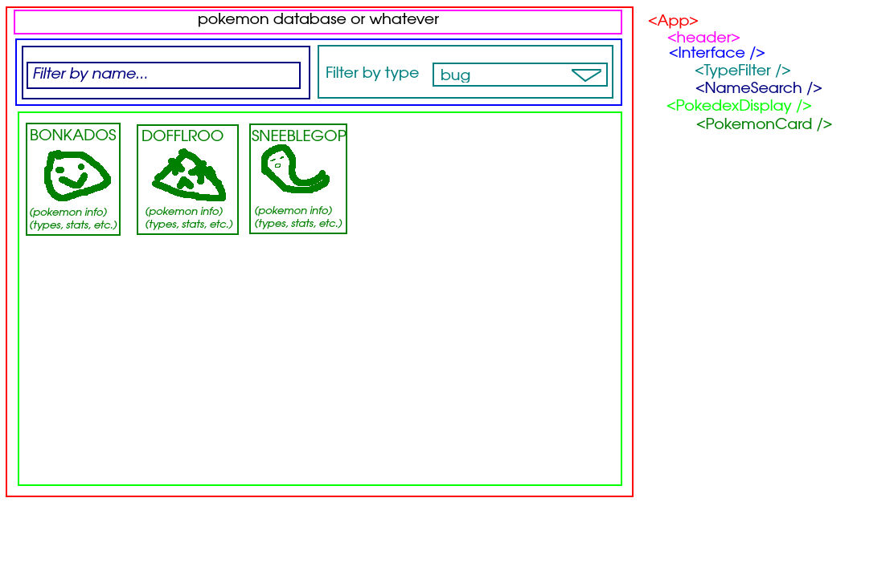

# README

Hook folder

- usePokemon.js

services folder

- fetchPokemon.js

## States (usePokemon.js)

- pokemon, setPokemon
- type, setType
- selectedType, setSelectedType

## Hooks (usePokemon.js)

- usePokemon
  - use resp from fetch to setPokemon
  - handleTypeChange

## Plan

1. Write fetch functions in fetchPokemon.js
2. Set states in usePokemon.js
3. App send props/functions/states to components
   1. make components
   2. import hook
   3. distribute props/states/functions to components
   4. map pokemon arr to PokemonCard component
